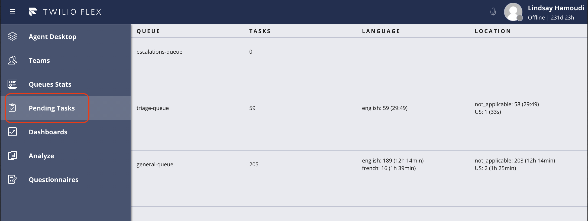
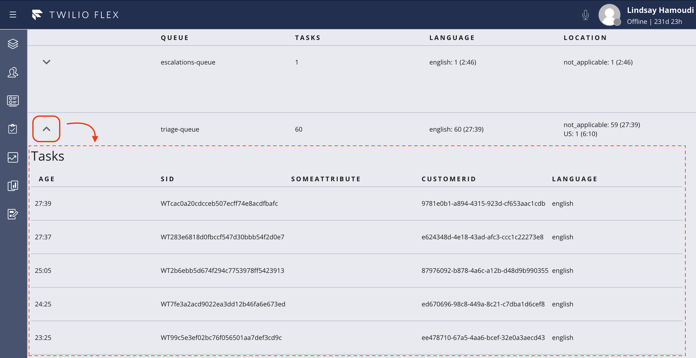
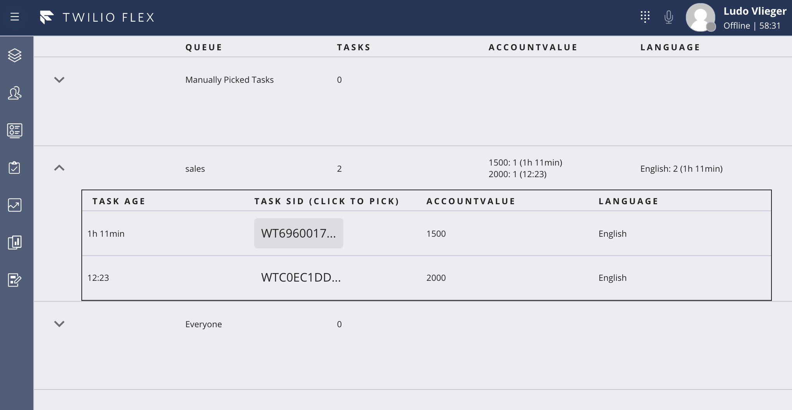
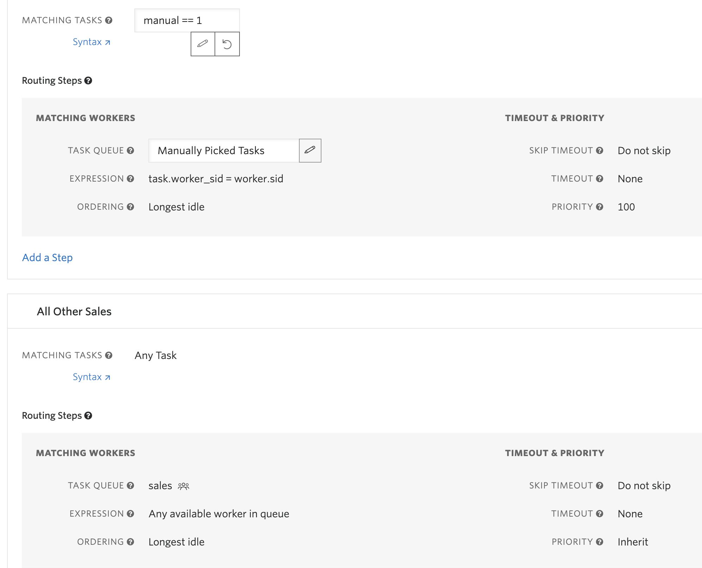

# Flex Pending Tasks View

This plugin introduces a new Flex tab/SideNav (see first screenshot) to allow supervisors and admins to visualize all tasks that are waiting in queues, with totals and max age. It differs from the [Real-Time Queues View](https://www.twilio.com/docs/flex/end-user-guide/insights/real-time-queues-view) in that: 

1. You can configure the screen to breakdown the number of tasks based on specific task attributes that are important to you. e.g. show me all the pending task totals broken down by the different `language` attribute values.
2. You can drill into the list of pending tasks (second screenshot) within each queue, and present specific task attributes that are meaningful to your solution. e.g. in addition to the Twilio Task SID, you might include your own internal identifier (if it's available as a task attribute) 

This gives a level of granularity beyond what the [Real-Time Queues View](https://www.twilio.com/docs/flex/end-user-guide/insights/real-time-queues-view) offers today.





3. New Functionality.  You can now click on the Task Sid to re-assign this task to the current worker (Supervisor).




Requirements:  Create a New Manually Picked Tasks Queue.  Add new skill "manual" and only give Supervisor this skill. Update the main TR Workflow as shown here:



Note: Set a Worker Attribute called sid and set its value to the SID of the worker returned by Twilio 

## Known Limitations
The plugin makes use of the [Flex InsightsClient](https://www.twilio.com/docs/flex/developer/ui/manager#insightsclient) to query the pre-existing `tr-queue` and `tr-task` indexes. Please note that the `InsightsClient` has certain [limits](https://www.twilio.com/docs/sync/limits#sync-insights-client-limits) in place, namely:

1. A maximum of 200 results can be returned by any one query (so if you have more than 200 queues, or more than 200 pending tasks on any queue, you'll need to introduce additional filtering to the plugin)
2. Sync enforces concurrency limits of 20 reads per second, per object (so if you have lots of queues and/or lots of supervisors concurrently running the plugin, you could potentially run into issues)


## Plugin Configuration
You can customize the Pending Tasks View by modifying the `CONFIG` object in the file, `src/utils/Constants.js`. e.g.

```javascript
export const CONFIG = {
  useLiveQuery: true, // Determines whether to query once and subscribe to updates, or poll using the same query repeatedly
  pollFrequencyInMillis: 30000, // Applicable only if useLiveQuery is false
  queueTaskColumns: ['myRelevantTaskAttribute', 'someOtherTaskAttribute'], // Used to break down the totals at the queue level
  taskAttributeColumns: ['myInternalCustomerIdentifierAttribute', 'myRelevantTaskAttribute'], // Used to present the list of tasks
};
```


## About Twilio Flex Plugins

Twilio Flex Plugins allow you to customize the appearance and behavior of [Twilio Flex](https://www.twilio.com/flex). If you want to learn more about the capabilities and how to use the API, check out our [Flex documentation](https://www.twilio.com/docs/flex).

## Setup

Make sure you have [Node.js](https://nodejs.org) as well as [`npm`](https://npmjs.com). We support Node >= 10.12 (and recommend the _even_ versions of Node). Afterwards, install the dependencies by running `npm install`:

```bash
cd 

# If you use npm
npm install
cd serverless
npm install
```

Next, please install the [Twilio CLI](https://www.twilio.com/docs/twilio-cli/quickstart) by running:

```bash
brew tap twilio/brew && brew install twilio
```

Finally, install the [Flex Plugin extension](https://github.com/twilio-labs/plugin-flex) for the Twilio CLI:

```bash
twilio plugins:install @twilio-labs/plugin-flex
```
Install the [Serverless toolkit](https://www.twilio.com/docs/labs/serverless-toolkit) for the Twilio CLI:

```bash
twilio plugins:install @twilio-labs/plugin-serverless
```

## Serverless Functions

### Functions Configuration

Create the functions config file by copying `.env.example` to `.env` 

```bash
cd serverless
cp .env.example .env
```

Open `.env` with your text editor and set the environment variables mentioned in the file.

```
TWILIO_ACCOUNT_SID = ACXXXXXXXXXXXXXXXXXXXXXXXXXXXXXXXX
TWILIO_AUTH_TOKEN = 9yyyyyyyyyyyyyyyyyyyyyyyyyyyyyyy
TWILIO_WORKSPACE_SID = WSXXXXXXXXXXXXXXXXXXXXXXXXXXXXXXXX
```

### Deployment

Deploy the function:

```bash
cd serverless
twilio serverless:deploy --override-existing-project --runtime node12
```
After successfull deployment you should see at least the following:
```bash
✔ Serverless project successfully deployed
Functions:
  https://manual-pick-task-xxxx-dev.twil.io/update-task
```

Your function will now be present in the Twilio Functions Console and part of the "manual-pick-task" service. Copy the URL from the function. 


## Flex Plugin

### Development

Create the plugin config file by copying `.env.example` to `.env` 

```bash
cp .env.example .env
```

Edit `.env` and set the REACT_APP_SERVICE_BASE_URL variable to your Twilio Functions base url (everything up until the first forward slash; this will be available after you deploy your function as mentioned above). In local development environment, it could be your localhost base url.

In order to develop locally, you can use the Twilio CLI to run the plugin locally. Using your commandline run the following from the root dirctory of the plugin.

```bash
twilio flex:plugins:start
```

This will automatically start up the Webpack Dev Server and open the browser for you. Your app will run on `http://localhost:3000`. If you want to change that you can do this by setting the `PORT` environment variable:

When you make changes to your code, the browser window will be automatically refreshed.

### Deploy

When you are ready to deploy your plugin, in your terminal run:
```
Run: 
twilio flex:plugins:deploy --major --changelog "Notes for this version" --description "Functionality of the plugin"
```
For more details on deploying your plugin, refer to the [deploying your plugin guide](https://www.twilio.com/docs/flex/plugins#deploying-your-plugin).

